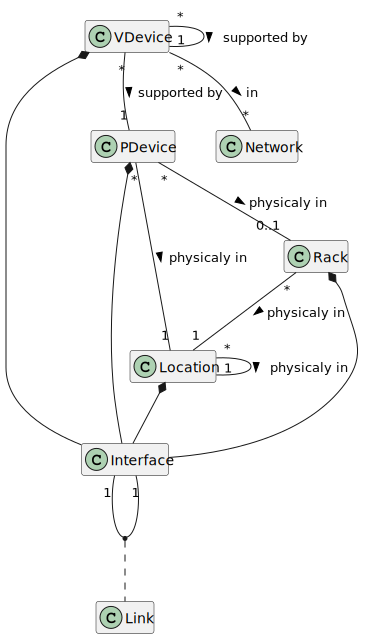

= Simple_Network_Documentation_Tools
:toc: macro
:toc-title: Table des matières
:sectnums:

----
███████╗███╗   ██╗██████╗ ████████╗    ██╗   ██╗  ██╗  Simple_Network_Documentation_Tools
██╔════╝████╗  ██║██╔══██╗╚══██╔══╝    ██║   ██║ ███║  
███████╗██╔██╗ ██║██║  ██║   ██║       ██║   ██║ ╚██║  On pose les bases.
╚════██║██║╚██╗██║██║  ██║   ██║       ╚██╗ ██╔╝  ██║  Vue des infrastructures logiques
███████║██║ ╚████║██████╔╝   ██║        ╚████╔╝██╗██║  Vue des infrastructures physiques
╚══════╝╚═╝  ╚═══╝╚═════╝    ╚═╝         ╚═══╝ ╚═╝╚═╝
----                                            

Un outil simple qui facilite la création et le maintien à jour de cartographies d'un réseau informatique.

<<<

toc::[Title="Table des matières"]

<<<

== Description

Cette application web est conçue pour documenter des réseaux de petite et moyenne taille. Les fonctionnalités attendues sont décrites plus loin dans ce document.

== Licences

Copyright (C) 2023 Harduin_Hero

Ce programme est un logiciel libre : vous pouvez le redistribuer et/ou le modifier selon les termes de la licence GNU. et/ou le modifier selon les termes de la Licence Publique Générale GNU telle que publiée par la la Free Software Foundation, soit la version 3 de la Licence ou toute version ultérieure.

Ce programme est distribué dans l'espoir qu'il sera utile, mais SANS AUCUNE GARANTIE ; sans même la garantie implicite de MERCHANTABILITÉ ou d'ADAPTATION À UN USAGE PARTICULIER. Voir la Licence publique générale GNU pour plus de détails.

Vous devriez avoir reçu une copie de la licence publique générale GNUavec ce programme.  Si ce n'est pas le cas, consultez <https://www.gnu.org/licenses/>.

== "Complience" ANSSI

L'usage et les fonctionnalités décrits dans le document de l'ANSSI "CARTOGRAPHIE DU SYSTÈME D'INFORMATION - Guide d'élaboration en 5 étapes" (https://cyber.gouv.fr/publications/cartographie-du-systeme-dinformation) ont servi de base lors de l'élaboration de cet outil. Pour la suite, ce document sera référé comme "Guide ANSSI".

[quote, Guide ANSSI p.5, Objectifs d'une cartographie]
____
Concrètement, la cartographie doit permettre de :

    • réaliser l'inventaire patrimonial du système d'information, à savoir la
      liste des composants du SI et leur description détaillée ;

    • présenter le système d'information sous forme de vues, à savoir des
      représentations partielles du SI, de ses liens et de son fonctionnement.
      Elles visent à rendre lisibles et compréhensibles différents aspects du
      système d'information.
____

== Fonctionalités de l'application

=== v.1

* **Editer**, **importer** des objets constituant le SI (cf. annexe 1 définition et proposition de contenu des différentes vues du Guide de l'ANSSI). +
Exemple : Switch, Routeur, Serveur, Baie, Batiment, Site géographique...
* **Editer**, **importer** des liens entre ces objets +
Exemple : switch -> routeur -> serveur, serveur virtuel -> serveur physique
* **Editer** des vues / schémas permettant d'afficher les objets du SI, leurs informations et relations. Nous traiterons les vues comme des objets. +
Exemple : Infrastructures physiques du batiment C, Infrastructure logique liée au processus RH
* **Gérer** le versionement des schémas (titre, date, numéro de version, légende).
* **Exporter** les schémas dans des formats de lecture accéptés par les outils classiques de burautique (.pdf, .html)

Posseder toutes les informations d'inventaire et de topographie d'un SI permet également de réaliser des traitements automatisés. Il s'agit ici de propositions optionelles.

* Recherche de bottle neck de vitesses de transfer.
* Créer un plan de configuration VLAN des switch à partir d'un liste d'attribution de VLAN aux host.
* Créer un plan de recherche de pannes à partir de symptomes.

== Langues et internationalisation

Cet outil sera développé en anglais (code, fichiers) et son interface sera disponible en Anglais et Français.

== Technologies

L'outil se présente sous la forme d'une application GUI portable. +
L'application est réalisée en python, la librairie graphique est PyQt6. Les fichiers d'interface sont réalisés avec QtCreator. +

== Schémas et vues

Les vues définies dans le guide de l'ANSSI permettent de classer les différents objets en catégories. La cartographie en elle-même se materialise par un enssemble de schémas (définis dans la liste ci dessous), certains de ces schémas sont la représentation d'un objet en lui-même (rack, emplacement) pour les autres, ils sont représentés commes des objets à part entère.

* Schéma de Baie/Rack
* Schéma d'emplacement/site/batiment
* Schéma de connexion physique
* Schéma logique

Il est possible de naviquer entre les schémas grace aux liens établis entre les différent objets.

== Représentation des données

L'application définit un certain nombre de classes d'objets primitives depuis lesquelles un utilisateur peut créer d'autres objets en fonction de ses besoins en y ajoutant des atributs. C'est classes primitives définissent le comportement des objets déclinés.

Ces classes primitivent fournissent toutent des attributs de base.

.Diagramme de classe des classes primitives

.Classes primitives et dérivés possibles (Guide ANSSI, Annexe 1)
|===
|Primitive |Guide ANSSI

|Rack
a|.Tableau 6 : Vue des infrastructures physiques
....
Baie
....

|Location
a|.Tableau 6 : Vue des infrastructures physiques
....
Site
Bâtiment
Sale
....

|PDevice
a|.Tableau 6 : Vue des infrastructures physiques
....
Serveur physique
Poste de travail
Infrastructure de stockage
Périphérique
Téléphone
Commutateur physique (switch)
Routeur physique
Borne wifi
Equipement de sécurité physique
....

|VDevice
a|.Tableau 5 : Vue des infrastructures logiques
....
Passerelle d'entrée depuis l'extérieur
Entité extérieure connectée
Commutateur (switch)
Routeur
Équipement de sécurité
Serveur DHCP
Serveur DNS
Serveur logique
....

|Network
a|.Tableau 5 : Vue des infrastructures logiques
....
Réseau
Sous-réseau
....
.Tableau 6 : Vue des infrastructures physiques
....
WAN (Wide Area Network)
MAN (Metropolitan Area Network)
LAN (Local Area Network)
VLAN (Virtual Area Network)
....

|Link
a|
....
Cable ethernet X Gb
Cable fibre X Gb
Liaison série X baud
Liaison paralelle
Liaison ISCSI
Liaison IPSEC
....
|===

== Format de fichiers

Un projet est stocké sous la forme d'un fichier xml d'extension `.sndp` [simple network documentation project].

..sndp file example
[source, xml]
----
<sndp sndt_version="0.0.0">
  <tree_structure>
  </tree_structure>
</sndp>
----

